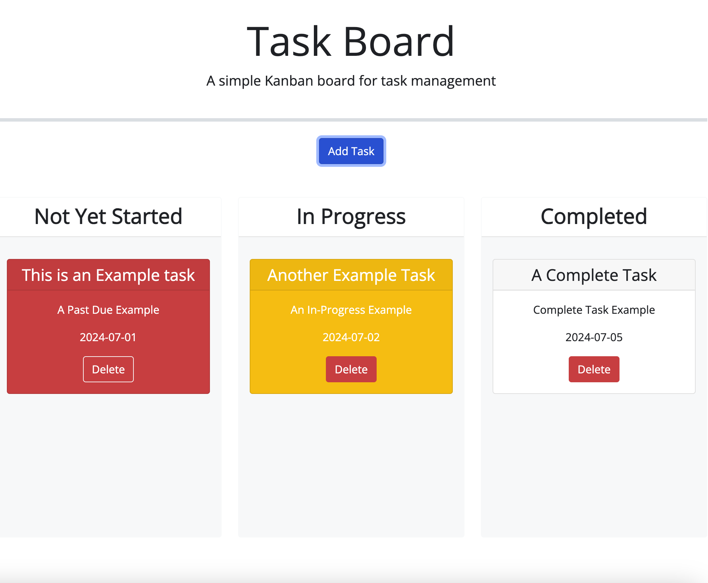
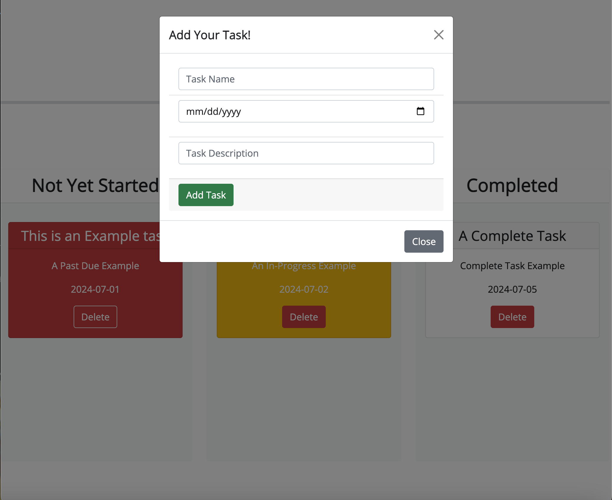

# week-five-challenge-karenas

Purpose:

The purpose of this project is to allow a team of users to manage project tasks by filtering them into one of three categories, not yet started, in progress and completed.

Functionality:

Users can add a task using the task form. Users can give the task a title, due date, and description. The new task will populate in the not-yet-started column and can be dragged to either the in-progress column or the completed column. Each task also comes with a delete button allowing the user to remove unwanted tasks, or those made in error.

Goals Accomplished:

Users are able to track the progress of tasks via the task list allowing for easy task management.

<strong>Notes:</strong> I refactored code from class materials and had a tutor and instructor help. The modal form is refactored from a bootstrap example form [found here](https://getbootstrap.com/docs/5.0/components/modal/#modal-components).  

deployed using gitHub pages at [https://katherinearenas.github.io/week-five-challenge-karenas/](https://katherinearenas.github.io/week-five-challenge-karenas/)  

This is a screenshot of the Task Board with one Past due task, one in-progress task, and one completed task: 

This is a screenshot of the Modal Add Task Form: 

